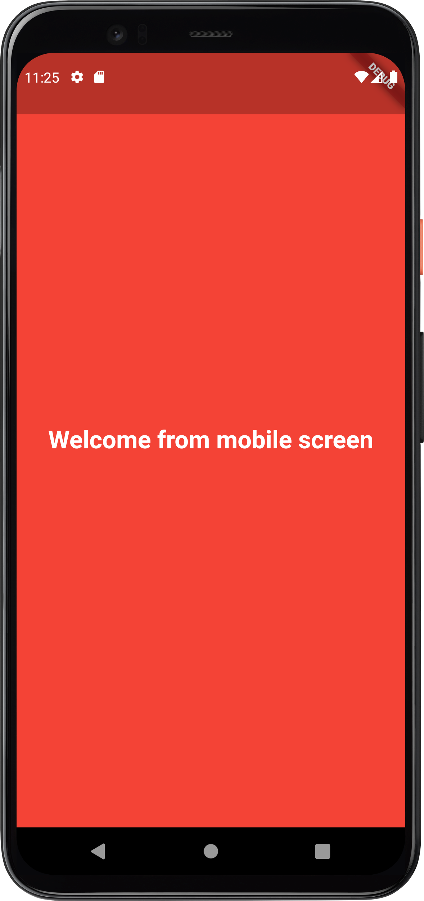
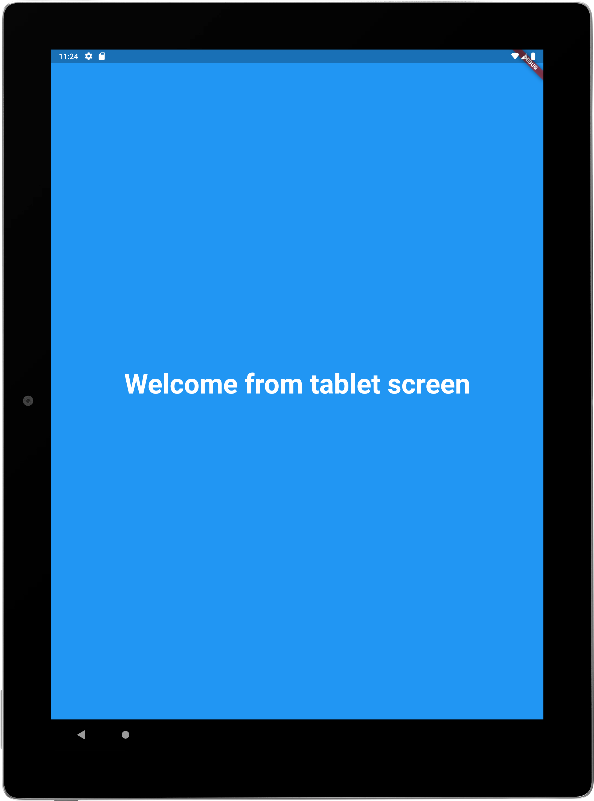
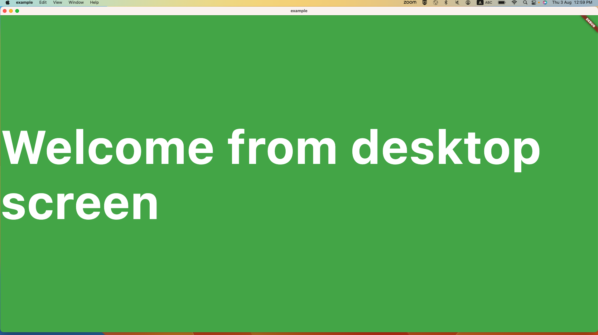

## Screenshot

|  |  |  |  |
|:--------------------------:|:--------------------------:|:---------------------------:|---------------------------|


## Getting started

Adding package #

```yaml

responsive_screens: ^1.0.0

```

Importing package #

```dart

import 'package:responsive_screens/responsive_screen_type.dart';

```

## Usage

To use this plugin, add rxdart_bloc as a dependency in your pubspec.yaml file.

## Example

Here are an example that show you how to use this plugin.

## main.dart
```dart
import 'package:flutter/material.dart';

import 'view/responsive_view.dart';

void main() {
  runApp(const MyApp());
}

class MyApp extends StatelessWidget {
  const MyApp({super.key});

  // This widget is the root of your application.
  @override
  Widget build(BuildContext context) {
    return const MaterialApp(
      title: 'Flutter responsive_screen',
      home:  ResponsiveView(),
    );
  }
}
```
## responsive_view.dart
```dart

import 'responsive_view_mobile.dart';
import 'responsive_view_tablet.dart';
import 'responsive_view_desktop.dart';
import 'package:flutter/material.dart';
import 'package:responsive_screens/responsive_screen_type.dart';

class ResponsiveView extends StatelessWidget {
  const ResponsiveView({Key? key}) : super(key: key);

  @override
  Widget build(BuildContext context) {
    return const ScreenTypeLayout(
      mobile: ResponsiveViewMobile(),
      tablet: ResponsiveViewTablet(),
      desktop: ResponsiveViewDesktop(),
    );
  }
}
```

## responsive_view_mobile.dart
```dart
import 'package:flutter/material.dart';

class ResponsiveViewMobile extends StatefulWidget {
  const ResponsiveViewMobile({Key? key}) : super(key: key);

  @override
  State<ResponsiveViewMobile> createState() => _ResponsiveViewMobileState();
}

class _ResponsiveViewMobileState extends State<ResponsiveViewMobile> {
  @override
  Widget build(BuildContext context) {
    // TODO: implement getBody
    return const Scaffold(
      backgroundColor: Colors.red,
      body: Center(
        child: Text(
          'Welcome from mobile screen',
          style: TextStyle(
              color: Colors.white, fontSize: 25, fontWeight: FontWeight.bold),
        ),
      ),
    );
  }
}
```
## products_repo_interface.dart
```dart
import 'package:rxdart_bloc/base_model.dart';

abstract interface class ProductsRepoInterface {
  Future<BaseModel> getProducts();
}
```
## responsive_screens widgets

## ScreenTypeLayout
**MultiBlocProvider** is a Flutter widget which provides a multi blocs to their children.

```dart
ScreenTypeLayout(
mobile: ResponsiveViewMobile(),
tablet: ResponsiveViewTablet(),
desktop: ResponsiveViewDesktop(),
);
```

